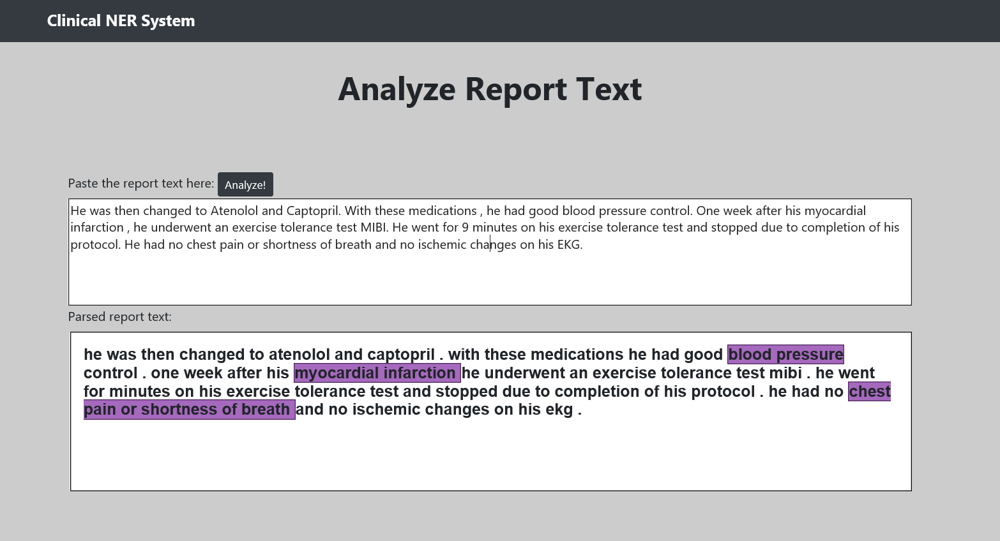

# Project Name

#### -- Project Status: [In-Progress]

## Project Intro/Objective
The purpose of this project is to identify the Named Entity Recognition in clinical reports. 
I used the Unified Medical Language System (UMLS) database for the baseline for disease and symptoms names.
The data used in this project is "n2c2 NLP Research Data Sets".
For UMLS and n2c2 dataset, we need proper license from the respective sites.

### Collaborators
|Name     |  Github Page   |  Personal Website  |
|---------|-----------------|--------------------|
|Asha Ponraj | [asha](https://github.com/aasha01)| [www.devskrol.com](https://devskrol.com/)  |

### Methods Used
* Conditional Random Fields from sklearn_crfsuite
* Machine Learning techniques
* NLP tasks
* Predictive Modeling
* Manual Data Annotation
* Feature Engineering and Extraction 
* etc.

### Technologies
* Python
* sklearn_crfsuite
* MySql
* Pandas, jupyter
* HTML
* etc.

<!--## Project Description
(Provide more detailed overview of the project.  Talk a bit about your data sources and what questions and hypothesis you are exploring. What specific data analysis/visualization and modelling work are you using to solve the problem? What blockers and challenges are you facing?  Feel free to number or bullet point things here)

## Getting Started

1. Clone this repo (for help see this [tutorial](https://help.github.com/articles/cloning-a-repository/)).
2. Raw Data is being kept [here](Repo folder containing raw data) within this repo.
3. Data processing/transformation scripts are being kept [here](Repo folder containing data processing scripts/notebooks)
4. etc...
5. Follow setup [instructions](Link to file)-->

## Future Updates in progress

1. Increase accuracy
2. CRF implementation
3. Negation detection

---

This file structure is based on the [DSSG machine learning pipeline](https://github.com/dssg/hitchhikers-guide/tree/master/sources/curriculum/0_before_you_start/pipelines-and-project-workflow).
